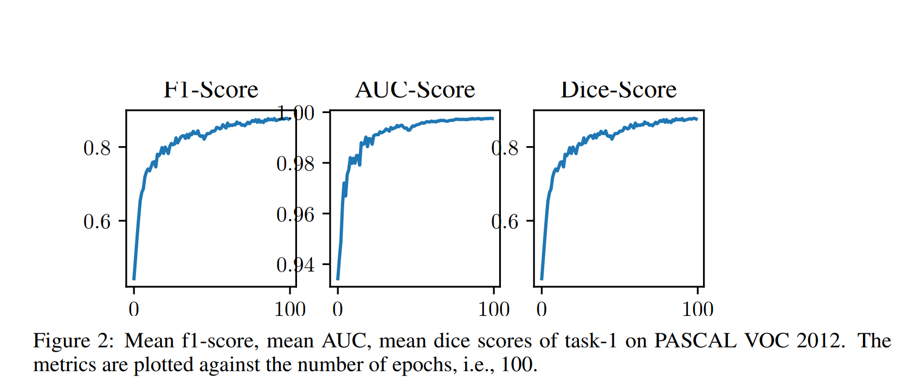

# Real-time Segmentation - A Study of Approaches
 
This repository contains the code for Segmentation Project for the completion of the course, Neural Networks: Theory and Implementation (Winter 2020/2021). 

## Requirements

The Cityscapes dataset, which can be downloaded  [here](https://www.cityscapes-dataset.com/).

NOTE: The code has been tested in Ubuntu 18.04, and **requirements.txt** contains all the nessary packages.

## Task 1 

The notebook,  [Vision_task_1.ipynb](https://github.com/Chris10M/Vision-Project-Image-Segmentation/blob/main/Task1/Vision_task_1.ipynb "Vision_task_1.ipynb") contains the training, evaluation and demo implementation.  

### Overview 
We evaluate the model with [PASCAL VOC 2012](http://host.robots.ox.ac.uk/pascal/VOC/voc2012/). 
The network is an efficient-net-b0,  along with PSP module. 

 

 

## Acknowledgement
Training code inpired from  [CoinCheung/BiSeNet](https://github.com/CoinCheung/BiSeNet)
