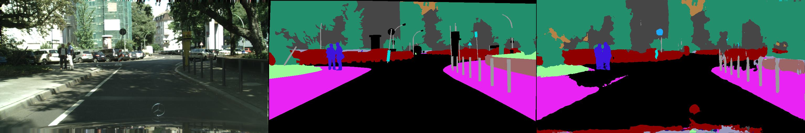
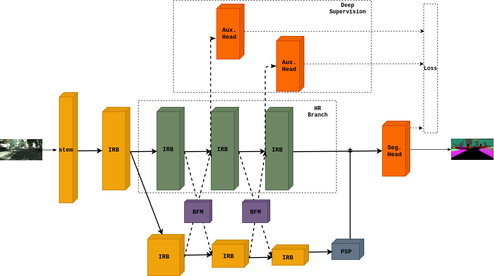
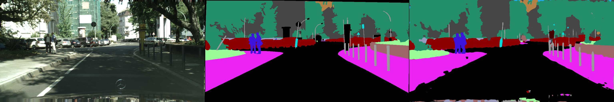

# Real-time Segmentation - A Study of Approaches
 
This repository contains the code for Segmentation Project for the completion of the course, Neural Networks: Theory and Implementation (Winter 2020/2021). 


## Requirements

The Cityscapes dataset, which can be downloaded  [here](https://www.cityscapes-dataset.com/).

NOTE: The code has been tested in Ubuntu 18.04, and **requirements.txt** contains all the nessary packages.


## Task 1 

The notebook,  [Vision_task_1.ipynb](https://github.com/Chris10M/Vision-Project-Image-Segmentation/blob/main/Task1/Vision_task_1.ipynb "Vision_task_1.ipynb") contains the training, evaluation and demo implementation.  

### Overview 
We evaluate the model with [PASCAL VOC 2012](http://host.robots.ox.ac.uk/pascal/VOC/voc2012/). 
The network is an efficient-net-b0,  along with PSP module. 

<p align="center">
</br>
</p>s 

<p align="center">
</br>
</p>

## Task 2 & 3

Both the tasks use the same framework with changes only to the model architecture.

### Train
To train the model,  we run train.py
```
python3 train.py --root Cityscapes_root_directory --model_path optional_param, to train from a checkpoint.
``` 
### Evaluate
The trainer, also evaluates the model for every save and logs the results, but if evaluation needs to be done for a particular model, we run evaluate.py

```
python3 evaluate.py --root Cityscapes_root_directory --model_path saved_model_path_to_evaluate.
``` 

### Demo

To visulaize the results,  we run demo.py.

```
python3 demo.py --root Cityscapes_root_directory --model_path saved_model_path_to_run_demo.
``` 

### Task 2 
For task 2, we use the model configuration as mentioned in **TABLE IV** of [R2U-Net](https://arxiv.org/pdf/1802.06955.pdf). 

The pretrained model is available [here](https://www.mediafire.com/file/ufma51z9c38kmdc/task2.pth/file) [4.36 MB]

And, a prediction of Task-2,
<p align="center">
</br>
</p>

### Task 3

Our network achieves a mIoU of  **64.32**  on the  [Cityscapes](https://www.cityscapes-dataset.com/)  val set without any pretrained model. And for an input resolution of 2048x1024, our network can run at the speed of  **21.8 FPS**  on a single RTX 2070 GPU.

Model architecture of Task 3,
 
 <p align="center">
</br>
</p>

The pretrained model is available [here](https://www.mediafire.com/file/bwbc80xz79m8dra/task3.pth/file) [13.07 MB]

And, a prediction of Task-3,
<p align="center">
</br>
</p>

## Acknowledgement
Training code inpired from  [CoinCheung/BiSeNet](https://github.com/CoinCheung/BiSeNet)
